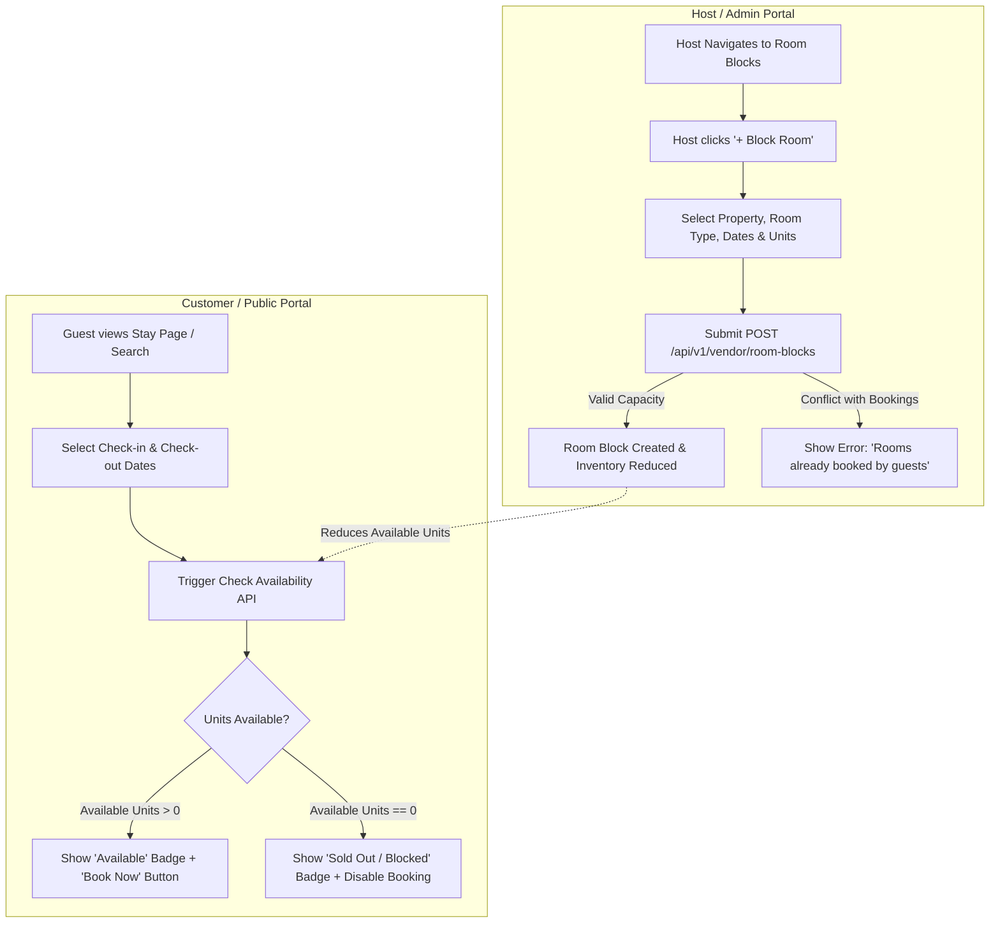

# Frontend Integration & UI Guide: Room Blocking & Real-Time Availability Checking

This comprehensive guide provides frontend engineers with the complete **UI/UX Component Layouts, Screen Wireframes, TypeScript Interfaces, API Payloads, Validation Rules, and Component Implementation Patterns** for:
1. **Host (Vendor) & Admin Room Blocking & Inventory Management**
2. **Customer / Public Real-Time Stay & Room Availability Checking**

---

## Table of Contents
1. [Architecture Overview & User Flows](#1-architecture-overview--user-flows)
2. [Screen Layouts & UI Wireframes](#2-screen-layouts--ui-wireframes)
   - [2.1 Host Portal: Room Blocks & Inventory Dashboard](#21-host-portal-room-blocks--inventory-dashboard)
   - [2.2 Host Portal: Block Room Modal / Drawer](#22-host-portal-block-room-modal--drawer)
   - [2.3 Host Portal: Edit Block & Release Confirmation Dialogs](#23-host-portal-edit-block--release-confirmation-dialogs)
   - [2.4 Customer Portal: Stay Detail Page with Room Availability Badges](#24-customer-portal-stay-detail-page-with-room-availability-badges)
   - [2.5 Customer Portal: Floating Date Picker & Availability Widget](#25-customer-portal-floating-date-picker--availability-widget)
3. [TypeScript Type Definitions](#3-typescript-type-definitions)
4. [API Endpoints & Request/Response Contracts](#4-api-endpoints--requestresponse-contracts)
   - [4.1 Host & Admin Room Blocking Endpoints](#41-host--admin-room-blocking-endpoints)
   - [4.2 Customer & Public Availability Endpoints](#42-customer--public-availability-endpoints)
5. [Inventory & Capacity Calculation Mechanics](#5-inventory--capacity-calculation-mechanics)
6. [Frontend Implementation Examples (Angular / TypeScript)](#6-frontend-implementation-examples-angular--typescript)
   - [6.1 Room Block Service](#61-room-block-service)
   - [6.2 Public Availability & Stay Service](#62-public-availability--stay-service)
   - [6.3 Customer Stay Room Selector Component Logic](#63-customer-stay-room-selector-component-logic)
7. [Validation Rules, Error Codes & User Messages](#7-validation-rules-error-codes--user-messages)

---

## 1. Architecture Overview & User Flows



---

## 2. Screen Layouts & UI Wireframes

### 2.1 Host Portal: Room Blocks & Inventory Dashboard
**Route**: `/vendor/room-blocks` (or `/admin/room-blocks`)

```
+---------------------------------------------------------------------------------------------------------+
| [ Property Operations ] / Room Blocks & Availability               [ + Block Room Units ] [ 🔄 Refresh ] |
+---------------------------------------------------------------------------------------------------------+
| [ METRIC CARDS ]                                                                                        |
| +---------------------+  +---------------------+  +---------------------+  +---------------------+      |
| | Active Blocks Today |  | Upcoming Blocks     |  | Total Units Blocked |  | Blocked Properties  |      |
| | 3 Units             |  | 5 Periods           |  | 12 Units            |  | 2 Properties        |      |
| +---------------------+  +---------------------+  +---------------------+  +---------------------+      |
+---------------------------------------------------------------------------------------------------------+
| [ FILTERS & CONTROLS ]                                                                                  |
| [ Property: All Properties ▼ ] [ Room Type: All Types ▼ ] [ Date Window: Any Date ▼ ] [🔍 Search Reason] |
+---------------------------------------------------------------------------------------------------------+
| PROPERTY            | ROOM TYPE      | DATE RANGE        | UNITS | REASON               | CREATOR | ACTIONS  |
+---------------------+----------------+-------------------+-------+----------------------+---------+----------+
| Himalayan Cottage   | Deluxe King    | 10 Sep - 15 Sep   | 2     | Annual AC & Painting | Self    | [Edit][🗑]|
| Tashi Alpine Stay   | Standard Room  | 01 Oct - 10 Oct   | 1     | Host Personal Stay   | Self    | [Edit][🗑]|
| Riverside Villa     | Luxury Suite   | 20 Sep - 25 Sep   | 1     | Plumbing Maintenance | Staff   | [Edit][🗑]|
+---------------------+----------------+-------------------+-------+----------------------+---------+----------+
| Showing 1 - 3 of 3 records                                                [ < Prev ] [ 1 ] [ Next > ]   |
+---------------------------------------------------------------------------------------------------------+
```

---

### 2.2 Host Portal: Block Room Modal / Drawer
**Triggered by**: Clicking `+ Block Room Units` on top-right of dashboard or selecting dates on a calendar grid.

```
+---------------------------------------------------------------------------------------+
|  Block Room Units for Maintenance / Personal Use                                  [X] |
+---------------------------------------------------------------------------------------+
|  Property:                                                                            |
|  [ Select Property (e.g., Himalayan Cottage)                                      ▼ ] |
|                                                                                       |
|  Room Type:                                                                           |
|  [ Select Room Type (e.g., Deluxe King Suite - 4 Total Units)                      ▼ ] |
|                                                                                       |
|  Block Date Range:                                                                    |
|  Start Date: [ 2026-09-10 📅 ]            End Date (Checkout): [ 2026-09-15 📅 ]       |
|  (Duration: 5 Nights)                                                                 |
|                                                                                       |
|  Units to Block:                                                                      |
|  [ - ]  [ 2 ]  [ + ]    (Available to block for these dates: 3 units)                 |
|                                                                                       |
|  Reason for Block (Optional):                                                         |
|  [ Select or Type: Maintenance / Renovation / Personal Stay / Seasonal Closure     ▼ ] |
|  [ Custom notes: AC repair and deep cleaning                                        ] |
+---------------------------------------------------------------------------------------+
|  [ Cancel ]                                                      [ 🔒 Confirm Block ] |
+---------------------------------------------------------------------------------------+
```

---

### 2.3 Host Portal: Edit Block & Release Confirmation Dialogs

#### Edit Modal:
```
+---------------------------------------------------------------------------------------+
|  Edit Room Block                                                                  [X] |
+---------------------------------------------------------------------------------------+
|  Property: Himalayan Cottage (Deluxe King Suite)                                      |
|                                                                                       |
|  Start Date: [ 2026-09-10 📅 ]            End Date (Checkout): [ 2026-09-18 📅 ]       |
|                                                                                       |
|  Units to Block: [ - ]  [ 2 ]  [ + ]                                                  |
|                                                                                       |
|  Reason: [ Extended painting schedule                                               ] |
+---------------------------------------------------------------------------------------+
|  [ Cancel ]                                                      [ 💾 Save Changes ]  |
+---------------------------------------------------------------------------------------+
```

#### Release / Delete Dialog:
```
+---------------------------------------------------------------------------------------+
|  ⚠️ Release Room Block?                                                               |
+---------------------------------------------------------------------------------------+
|  Are you sure you want to remove the block on Deluxe King Suite (2 units)             |
|  from 10 Sep 2026 to 15 Sep 2026?                                                     |
|                                                                                       |
|  These room units will immediately become available for guests to book online.        |
+---------------------------------------------------------------------------------------+
|  [ Cancel ]                                               [ 🔓 Yes, Release Block ]   |
+---------------------------------------------------------------------------------------+
```

---

### 2.4 Customer Portal: Stay Detail Page with Room Availability Badges
**Route**: `/stays/{slug}`

When dates are selected, room cards dynamically reflect their real-time available units, blocked units, and booking actions:

```
+---------------------------------------------------------------------------------------------------------+
|  [ Stays ] / Himalayan Alpine Homestay                                              ⭐ 4.85 (24 reviews) |
+---------------------------------------------------------------------------------------------------------+
|  📅 Selected Dates: [ 10 Sep 2026 -> 15 Sep 2026 (5 Nights) ]  👥 Guests: [ 2 Adults ] [ 🔄 Change ]     |
+---------------------------------------------------------------------------------------------------------+
|                                                                                                         |
|  ROOM TYPES & AVAILABILITY                                                                              |
|                                                                                                         |
|  +---------------------------------------------------------------------------------------------------+  |
|  | [ Room Image ] | Deluxe Mountain View Suite                                                       |  |
|  |                | 🛏️ 1 King Bed | 👥 Max 2 Guests | 📐 350 sq ft | 📶 WiFi, Balcony, Heater        |  |
|  |                |                                                                                  |  |
|  |                | 🔴 SOLD OUT / BLOCKED FOR SELECTED DATES                                         |  |
|  |                | (All units are blocked for maintenance or booked)                                |  |
|  |                |                                                                                  |  |
|  |                | ₹3,500 / night                                            [ 🚫 Unavailable ]     |  |
|  +---------------------------------------------------------------------------------------------------+  |
|                                                                                                         |
|  +---------------------------------------------------------------------------------------------------+  |
|  | [ Room Image ] | Standard Cozy Room                                                               |  |
|  |                | 🛏️ 1 Queen Bed | 👥 Max 2 Guests | 📐 250 sq ft | 📶 WiFi, Garden View             |  |
|  |                |                                                                                  |  |
|  |                | 🟢 AVAILABLE (Only 1 room left for these dates!)                                 |  |
|  |                |                                                                                  |  |
|  |                | ₹2,200 / night                                            [ 🛒 Reserve Room ]    |  |
|  +---------------------------------------------------------------------------------------------------+  |
+---------------------------------------------------------------------------------------------------------+
```

---

### 2.5 Customer Portal: Floating Date Picker & Availability Widget

```
+-----------------------------------------------------------------------+
|  ₹2,200 / night                                     ⭐ 4.85 (24 rev)  |
+-----------------------------------------------------------------------+
|  CHECK-IN                CHECK-OUT                                    |
|  [ 2026-09-10       ]    [ 2026-09-15        ]                        |
|                                                                       |
|  ROOM TYPE                                                            |
|  [ Deluxe Mountain View Suite (Sold Out / Blocked)                  ▼]|
|                                                                       |
|  ROOMS                                                                |
|  [ - ]   [ 1 ]   [ + ]                                                |
+-----------------------------------------------------------------------+
|  ⚠️ This room type is blocked/unavailable for your selected dates.     |
|  👉 Please choose 'Standard Cozy Room' or select different dates.     |
+-----------------------------------------------------------------------+
|  [ 🔒 Reserve (Disabled) ]                                            |
+-----------------------------------------------------------------------+
```

---

## 3. TypeScript Type Definitions

```typescript
// ==========================================
// 1. Room Block Models (Host / Admin Portal)
// ==========================================

export interface RoomBlockProperty {
  id: string; // Property UUID
  name: string;
  slug?: string;
  address?: string;
  price_per_night?: number;
  currency?: string;
}

export interface RoomBlockRoomType {
  id: string; // Room Type UUID
  name: string;
  capacity?: number;
}

export interface RoomBlockCreator {
  id: string;
  full_name?: string;
  email?: string;
  role?: string;
}

export interface RoomBlock {
  id: string; // Room Block UUID
  block_start_date: string; // "YYYY-MM-DD"
  block_end_date: string;   // "YYYY-MM-DD"
  units_blocked: number;
  reason?: string | null;
  created_at?: string;
  updated_at?: string;
  property?: RoomBlockProperty;
  room_type?: RoomBlockRoomType;
  creator?: RoomBlockCreator;
}

export interface RoomBlockCreatePayload {
  property_id: string; // Property UUID, slug, or ID
  room_type_id: string; // RoomType UUID or PropertyRoomType UUID
  block_start_date: string; // "YYYY-MM-DD"
  block_end_date: string;   // "YYYY-MM-DD"
  units_blocked: number;
  reason?: string | null;
}

export interface RoomBlockUpdatePayload {
  block_start_date?: string;
  block_end_date?: string;
  units_blocked?: number;
  reason?: string | null;
}

export interface RoomBlockQueryParams {
  page?: number;
  size?: number;
  property_id?: string;
  room_type_id?: string;
  start_date?: string;
  end_date?: string;
  search?: string;
  sort_by?: "created_at" | "block_start_date" | "block_end_date" | "units_blocked" | "updated_at";
  sort_order?: "asc" | "desc";
}

export interface RoomBlockListResponse {
  status: "success" | "error";
  message: string;
  data: RoomBlock[];
  meta: {
    page: number;
    page_size: number;
    total_pages: number;
    total_records: number;
    has_next: boolean;
    has_prev: boolean;
  };
}

// ==========================================
// 2. Availability Models (Customer / Public)
// ==========================================

export interface BookingAvailabilityPayload {
  property_id: string; // UUID or slug
  check_in_date: string; // "YYYY-MM-DD"
  check_out_date: string; // "YYYY-MM-DD"
  room_type_id?: string | null; // Optional: UUID of RoomType or PropertyRoomType
  num_rooms?: number; // default: 1
  num_guests?: number; // default: 1
}

export interface RoomTypeAvailability {
  property_room_type_id: string;
  room_type_id: string;
  room_type_name: string;
  total_units: number;
  booked_units: number;
  blocked_units: number;
  available_units: number;
  is_available: boolean;
}

export interface PricingQuoteItem {
  date: string;
  base_price: number;
  is_weekend: boolean;
}

export interface BookingQuote {
  nights: number;
  num_rooms: number;
  num_guests: number;
  base_price_per_night: number;
  subtotal: number;
  tax_amount: number;
  cleaning_fee: number;
  service_fee: number;
  discount_amount: number;
  total_amount: number;
  currency: string;
  nightly_breakdown: PricingQuoteItem[];
}

export interface BookingAvailabilityData {
  is_available: boolean;
  available_units: number;
  total_units: number;
  booked_units: number;
  blocked_units: number;
  requested_rooms: number;
  quote?: BookingQuote | null;
  room_types_availability?: RoomTypeAvailability[];
}

export interface BookingAvailabilityResponse {
  status: "success" | "error";
  message: string;
  data: BookingAvailabilityData;
}
```

---

## 4. API Endpoints & Request/Response Contracts

### 4.1 Host & Admin Room Blocking Endpoints

| Method | Endpoint | Description | Auth Required |
| :--- | :--- | :--- | :--- |
| `GET` | `/api/v1/vendor/room-blocks` | List room blocks for vendor properties | `Bearer <token>` (`vendor`) |
| `POST` | `/api/v1/vendor/room-blocks` | Create a new room block | `Bearer <token>` (`vendor`) |
| `GET` | `/api/v1/vendor/room-blocks/{id}` | Get room block detail | `Bearer <token>` (`vendor`) |
| `PUT` | `/api/v1/vendor/room-blocks/{id}` | Update dates, units, or reason | `Bearer <token>` (`vendor`) |
| `DELETE` | `/api/v1/vendor/room-blocks/{id}` | Remove / release room block | `Bearer <token>` (`vendor`) |
| `GET` | `/api/v1/admin/room-blocks` | Global list of room blocks | `Bearer <token>` (`admin`/`staff`) |
| `POST` | `/api/v1/admin/room-blocks` | Admin create room block | `Bearer <token>` (`admin`/`staff`) |
| `DELETE` | `/api/v1/admin/room-blocks/{id}` | Admin delete room block | `Bearer <token>` (`admin`/`staff`) |

#### Sample POST `/api/v1/vendor/room-blocks` Request:
```json
{
  "property_id": "b3e0c034-e43c-41c3-8833-2895ea912f20",
  "room_type_id": "f516a73c-bce0-482a-89a3-5cbe3a7f8051",
  "block_start_date": "2026-09-10",
  "block_end_date": "2026-09-15",
  "units_blocked": 1,
  "reason": "Host family visit"
}
```

---

### 4.2 Customer & Public Availability Endpoints

| Method | Endpoint | Description | Auth Required |
| :--- | :--- | :--- | :--- |
| `POST` | `/api/v1/public/stays/check-availability` | Check room/stay availability & pricing quote | **None** (Public) |
| `POST` | `/api/v1/public/properties/check-availability` | Check room/property availability | **None** (Public) |
| `POST` | `/api/v1/user/bookings/check-availability` | Check availability before checkout | `Bearer <token>` |
| `GET` | `/api/v1/public/stays/{slug}?check_in_date=YYYY-MM-DD&check_out_date=YYYY-MM-DD` | Get stay details with room-by-room availability badges | **None** (Public) |
| `GET` | `/api/v1/public/stays?check_in_date=YYYY-MM-DD&check_out_date=YYYY-MM-DD&rooms=1` | Search available stays (excludes 100% blocked properties) | **None** (Public) |

#### Sample POST `/api/v1/public/stays/check-availability` Request:
```json
{
  "property_id": "himalayan-alpine-homestay",
  "room_type_id": "f516a73c-bce0-482a-89a3-5cbe3a7f8051",
  "check_in_date": "2026-09-10",
  "check_out_date": "2026-09-15",
  "num_rooms": 1,
  "num_guests": 2
}
```

#### Sample Response when Room is Blocked / Sold Out:
```json
{
  "status": "success",
  "message": "Availability check completed.",
  "data": {
    "is_available": false,
    "available_units": 0,
    "total_units": 1,
    "booked_units": 0,
    "blocked_units": 1,
    "requested_rooms": 1,
    "quote": null,
    "room_types_availability": [
      {
        "property_room_type_id": "e838b971-6101-447b-bb68-8097d7620bc2",
        "room_type_id": "f516a73c-bce0-482a-89a3-5cbe3a7f8051",
        "room_type_name": "Deluxe Mountain View Suite",
        "total_units": 1,
        "booked_units": 0,
        "blocked_units": 1,
        "available_units": 0,
        "is_available": false
      }
    ]
  }
}
```

---

## 5. Inventory & Capacity Calculation Mechanics

$$\text{Available Units} = \max\Big(0, \; \text{Total Configured Units} - (\text{Active Bookings} + \text{Active Blocks})\Big)$$

- **Interval Overlap Condition**: A block or booking overlaps with requested stay if:
  $$\text{block\_start\_date} < \text{check\_out\_date} \quad \text{AND} \quad \text{block\_end\_date} > \text{check\_in\_date}$$
- **Single Room Type Properties**: If the user omits `room_type_id`, the backend automatically resolves the sole room type and subtracts its blocks.
- **Multiple Room Types**: If `room_type_id` is omitted, the response returns the aggregated property availability plus the `room_types_availability` array with individual room states.

---

## 6. Frontend Implementation Examples (Angular / TypeScript)

### 6.1 Room Block Service (`room-block.service.ts`)
```typescript
import { Injectable } from '@angular/core';
import { HttpClient, HttpParams } from '@angular/common/http';
import { Observable } from 'rxjs';
import {
  RoomBlockCreatePayload,
  RoomBlockUpdatePayload,
  RoomBlockQueryParams,
  RoomBlockResponse,
  RoomBlockListResponse
} from './room-block.models';

@Injectable({ providedIn: 'root' })
export class RoomBlockService {
  private readonly baseUrl = '/api/v1/vendor/room-blocks';

  constructor(private http: HttpClient) {}

  getRoomBlocks(params?: RoomBlockQueryParams): Observable<RoomBlockListResponse> {
    let httpParams = new HttpParams();
    if (params) {
      Object.keys(params).forEach((key) => {
        const val = (params as any)[key];
        if (val !== undefined && val !== null && val !== '') {
          httpParams = httpParams.set(key, val);
        }
      });
    }
    return this.http.get<RoomBlockListResponse>(this.baseUrl, { params: httpParams });
  }

  createRoomBlock(payload: RoomBlockCreatePayload): Observable<RoomBlockResponse> {
    return this.http.post<RoomBlockResponse>(this.baseUrl, payload);
  }

  updateRoomBlock(blockId: string, payload: RoomBlockUpdatePayload): Observable<RoomBlockResponse> {
    return this.http.put<RoomBlockResponse>(`${this.baseUrl}/${blockId}`, payload);
  }

  deleteRoomBlock(blockId: string): Observable<RoomBlockResponse> {
    return this.http.delete<RoomBlockResponse>(`${this.baseUrl}/${blockId}`);
  }
}
```

---

### 6.2 Public Availability & Stay Service (`stay-availability.service.ts`)
```typescript
import { Injectable } from '@angular/core';
import { HttpClient, HttpParams } from '@angular/common/http';
import { Observable } from 'rxjs';
import {
  BookingAvailabilityPayload,
  BookingAvailabilityResponse
} from './room-block.models';

@Injectable({ providedIn: 'root' })
export class StayAvailabilityService {
  constructor(private http: HttpClient) {}

  // 1. Check specific room or property availability
  checkAvailability(payload: BookingAvailabilityPayload): Observable<BookingAvailabilityResponse> {
    return this.http.post<BookingAvailabilityResponse>(
      '/api/v1/public/stays/check-availability',
      payload
    );
  }

  // 2. Fetch stay detail with real-time room availability attached
  getStayWithAvailability(slug: string, checkInDate?: string, checkOutDate?: string): Observable<any> {
    let params = new HttpParams();
    if (checkInDate && checkOutDate) {
      params = params.set('check_in_date', checkInDate).set('check_out_date', checkOutDate);
    }
    return this.http.get<any>(`/api/v1/public/stays/${slug}`, { params });
  }
}
```

---

### 6.3 Customer Stay Room Selector Component Logic
```typescript
import { Component, OnInit } from '@angular/core';
import { StayAvailabilityService } from './stay-availability.service';
import { RoomTypeAvailability, BookingQuote } from './room-block.models';

@Component({
  selector: 'app-stay-room-selector',
  templateUrl: './stay-room-selector.component.html',
})
export class StayRoomSelectorComponent implements OnInit {
  propertySlug = 'himalayan-alpine-homestay';
  checkInDate: string = '2026-09-10';
  checkOutDate: string = '2026-09-15';
  selectedRoomTypeId: string | null = null;
  numRooms: number = 1;

  isCheckingAvailability = false;
  isAvailable = false;
  availableUnits = 0;
  quote: BookingQuote | null = null;
  roomTypes: RoomTypeAvailability[] = [];
  errorMessage: string | null = null;

  constructor(private availabilityService: StayAvailabilityService) {}

  ngOnInit(): void {
    this.checkAvailability();
  }

  onDatesChanged(): void {
    this.checkAvailability();
  }

  onSelectRoomType(roomTypeId: string): void {
    this.selectedRoomTypeId = roomTypeId;
    this.checkAvailability();
  }

  checkAvailability(): void {
    this.isCheckingAvailability = true;
    this.errorMessage = null;

    this.availabilityService
      .checkAvailability({
        property_id: this.propertySlug,
        room_type_id: this.selectedRoomTypeId,
        check_in_date: this.checkInDate,
        check_out_date: this.checkOutDate,
        num_rooms: this.numRooms,
      })
      .subscribe({
        next: (res) => {
          this.isCheckingAvailability = false;
          this.isAvailable = res.data.is_available;
          this.availableUnits = res.data.available_units;
          this.quote = res.data.quote || null;
          this.roomTypes = res.data.room_types_availability || [];
        },
        error: (err) => {
          this.isCheckingAvailability = false;
          this.isAvailable = false;
          this.errorMessage =
            err.error?.message || 'Unable to check room availability for selected dates.';
        },
      });
  }
}
```

---

## 7. Validation Rules, Error Codes & User Messages

| Error Code | HTTP Status | Trigger Condition | Recommended User Message |
| :--- | :--- | :--- | :--- |
| `INVALID_CHECK_IN_DATE` | `400` | Check-in date is in the past | "Check-in date cannot be in the past." |
| `INVALID_CHECK_OUT_DATE` | `400` | Check-out date is not after check-in | "Check-out date must be at least 1 day after check-in date." |
| `INVALID_START_DATE` | `400` | Block start date is in the past | "Block start date cannot be in the past." |
| `INVALID_END_DATE` | `400` | Block end date is before start date | "Block end date must be after the start date." |
| `ROOM_TYPE_NOT_FOUND` | `404` | Room type ID does not exist | "The selected room type could not be found." |
| `ROOM_TYPE_NOT_ON_PROPERTY` | `400` | Room type does not belong to property | "Selected room type is not configured on this property." |
| `UNITS_EXCEED_TOTAL` | `400` | Units to block exceed physical inventory | "Cannot block more units than the total configured inventory." |
| `INSUFFICIENT_UNITS_AVAILABLE` | `400` | Units conflict with guest bookings | "Cannot block room units because rooms are already booked by guests for these dates." |
| `PROPERTY_ACCESS_DENIED` | `403` | Host does not own this property | "You do not have permission to manage room blocks for this property." |
| `ROOM_BLOCK_NOT_FOUND` | `404` | Room block ID does not exist | "Room block record not found." |
| `ROOM_BLOCK_ACCESS_DENIED` | `403` | Host does not own this room block | "You do not have permission to modify this room block." |
