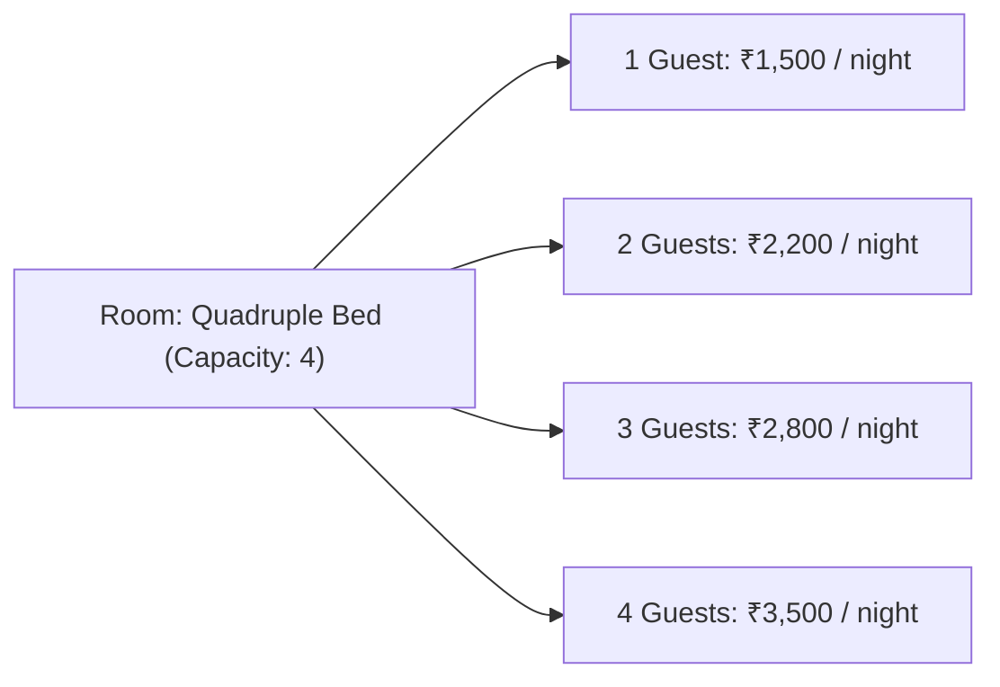

# Frontend Integration & UI Guide: Variable Pricing Model Based on Room Capacity

This comprehensive guide provides frontend engineers with the complete **UI/UX Component Layouts, Screen Wireframes, TypeScript Interfaces, API Payloads, Dynamic Price Calculation Logic, and Implementation Patterns** for:
1. **Host (Vendor) & Admin Property Setup**: Configuring variable pricing tiers based on room occupancy (e.g. 1 guest, 2 guests, 3 guests, 4 guests in a 4-bedded room).
2. **Customer / Public Portal**: Dynamic price updates on stay detail pages, interactive guest counter sliders/steppers, real-time availability check, and checkout price breakdowns.

---

## Table of Contents
1. [Core Concepts & Pricing Mechanics](#1-core-concepts--pricing-mechanics)
2. [Screen Layouts & UI Wireframes](#2-screen-layouts--ui-wireframes)
   - [2.1 Host/Admin: Room Type & Occupancy Pricing Tier Builder](#21-hostadmin-room-type--occupancy-pricing-tier-builder)
   - [2.2 Customer Portal: Stay Detail Page with Dynamic Guest Pricing](#22-customer-portal-stay-detail-page-with-dynamic-guest-pricing)
   - [2.3 Customer Portal: Booking Summary & Checkout Breakdown](#23-customer-portal-booking-summary--checkout-breakdown)
3. [TypeScript Type Definitions](#3-typescript-type-definitions)
4. [API Endpoints & Request/Response Contracts](#4-api-endpoints--requestresponse-contracts)
   - [4.1 Admin & Vendor: Create / Update Property with Pricing Tiers](#41-admin--vendor-create--update-property-with-pricing-tiers)
   - [4.2 Public Stay Detail (with Room Pricing Tiers)](#42-public-stay-detail-with-room-pricing-tiers)
   - [4.3 Availability & Dynamic Pricing Quote](#43-availability--dynamic-pricing-quote)
   - [4.4 Create Booking with Variable Price](#44-create-booking-with-variable-price)
5. [Frontend Helper Functions & Price Resolvers](#5-frontend-helper-functions--price-resolvers)
6. [Interactive UI Component Example (React / TypeScript)](#6-interactive-ui-component-example-react--typescript)
7. [Validation Rules, Edge Cases & Error Handling](#7-validation-rules-edge-cases--error-handling)

---

## 1. Core Concepts & Pricing Mechanics

### Why Variable Pricing by Room Capacity?
A homestay or hotel may have a **4-bedded room** (e.g., Family Room or Quadruple Bedded Room).
- If a solo traveler or couple (1-2 guests) books this room, the host can offer a reduced rate (e.g., ₹1,800 or ₹2,200/night).
- If a group of 3-4 guests books this room, the host charges full occupancy rate (e.g., ₹3,000 or ₹3,500/night).



### Backend Pricing Hierarchy:
When a guest queries price or books:
1. `guests_per_room = Math.ceil(num_guests / num_rooms)`.
2. Find matching tier in `property_room_type.pricing_tiers` where `tier.occupancy == guests_per_room`.
3. If exact match is absent, pick the closest tier (highest tier $\le$ `guests_per_room`, or lowest tier).
4. `effective_rate = tier.sale_per_night if (tier.sale_per_night > 0 and tier.sale_per_night < tier.price_per_night) else tier.price_per_night`.
5. If no tiers are configured, fall back to `property_room_type.price_per_night` or `property.price_per_night`.

---

## 2. Screen Layouts & UI Wireframes

### 2.1 Host/Admin: Room Type & Occupancy Pricing Tier Builder

Hosts and admins can add room types and configure pricing tiers for each capacity level up to the room's maximum capacity.

```
+---------------------------------------------------------------------------------------------------+
|  STEP 3: ROOM INVENTORY & VARIABLE PRICING                                                        |
+---------------------------------------------------------------------------------------------------+
|                                                                                                   |
|  [ Room Type: 4-Bedded Family Room (Max Capacity: 4)                                          v ] |
|  Total Units in Property: [ 3 ]                                                                   |
|                                                                                                   |
|  Base Room Rate (Fallback):   Standard: [ ₹ 3,500 ]   Discount/Sale: [ ₹ 3,200 ]                  |
|                                                                                                   |
|  +-- OCCUPANCY-BASED VARIABLE PRICING TIERS ---------------------------------------------------+  |
|  | Set different rates depending on how many guests occupy this room:                          |  |
|  |                                                                                             |  |
|  |  Occupancy      Standard Rate / Night      Sale/Offer Rate          Action                  |  |
|  |  -----------------------------------------------------------------------------------------  |  |
|  |  [ 1 Guest   ]  ₹ [ 1,500.00             ]  ₹ [ 1,400.00         ]  [ Default Base       ]  |  |
|  |  [ 2 Guests  ]  ₹ [ 2,200.00             ]  ₹ [ 2,000.00         ]  [ Delete Bin Icon    ]  |  |
|  |  [ 3 Guests  ]  ₹ [ 2,800.00             ]  ₹ [ 2,600.00         ]  [ Delete Bin Icon    ]  |  |
|  |  [ 4 Guests  ]  ₹ [ 3,500.00             ]  ₹ [ 3,200.00         ]  [ Delete Bin Icon    ]  |  |
|  |                                                                                             |  |
|  |  [ + Add Pricing Tier ]  (Disabled if all capacities 1..Max are added)                     |  |
|  +---------------------------------------------------------------------------------------------+  |
|                                                                                                   |
|  [ + Add Another Room Type ]                                                                      |
+---------------------------------------------------------------------------------------------------+
```

---

### 2.2 Customer Portal: Stay Detail Page with Dynamic Guest Pricing

As the customer adjusts the guest counter, the room cards dynamically highlight the price for that guest count:

```
+---------------------------------------------------------------------------------------------------+
|  4-Bedded Deluxe Room                                                [ Max 4 Guests ] [ 3 Units ] |
|  4 Single Beds • Mountain View • Attached Bathroom • Free Wi-Fi                                   |
|                                                                                                   |
|  Guest Selection for this Room:  ( - ) [ 2 Guests ] ( + )                                         |
|                                                                                                   |
|  +-- DYNAMIC PRICE TABLE -----------------------------------------------------------------------+  |
|  |  • 1 Guest:   ₹1,500 / night                                                                 |  |
|  |  • 2 Guests:  ₹2,000 / night  <-- [ CURRENTLY SELECTED: ₹2,000 / night ]                     |  |
|  |  • 3 Guests:  ₹2,600 / night                                                                 |  |
|  |  • 4 Guests:  ₹3,200 / night                                                                 |  |
|  +----------------------------------------------------------------------------------------------+  |
|                                                                                                   |
|  Price for 2 Guests (1 Room x 2 Nights):  ₹ 4,000.00                                              |
|                                                                                                   |
|  [ 2 Units Available for Selected Dates ]                      [ SELECT & BOOK ROOM ]             |
+---------------------------------------------------------------------------------------------------+
```

---

### 2.3 Customer Portal: Booking Summary & Checkout Breakdown

```
+-----------------------------------------------------------------------------+
|  BOOKING BREAKDOWN                                                          |
+-----------------------------------------------------------------------------+
|  Stay:             Himalayan Bliss Homestay                                 |
|  Room:             4-Bedded Deluxe Room                                     |
|  Dates:            Sep 12, 2026 -> Sep 14, 2026 (2 Nights)                  |
|  Guests / Rooms:   2 Guests • 1 Room                                        |
|  Applied Rate:     ₹ 2,000 / night (2-Guest Occupancy Tier)                 |
|                                                                             |
|  -------------------------------------------------------------------------  |
|  Base Amount (₹2,000 x 1 room x 2 nights)                       ₹ 4,000.00  |
|  Discount                                                         - ₹ 0.00  |
|  Taxes & Service Fees                                             + ₹ 0.00  |
|  -------------------------------------------------------------------------  |
|  TOTAL PAYABLE:                                                 ₹ 4,000.00  |
|                                                                             |
|  [ PROCEED TO PAYMENT (Razorpay) ]                                          |
+-----------------------------------------------------------------------------+
```

---

## 3. TypeScript Type Definitions

```typescript
// ==========================================
// 1. Variable Pricing Tier Model
// ==========================================
export interface PropertyRoomTypePrice {
  id?: string;
  occupancy: number; // 1, 2, 3, 4, etc.
  price_per_night: number; // e.g. 2200.00
  sale_per_night?: number; // e.g. 2000.00
}

// ==========================================
// 2. Room Type with Pricing Tiers
// ==========================================
export interface RoomTypeNested {
  id: string;
  name: string;
  capacity: number; // Maximum capacity (e.g. 4)
}

export interface PropertyRoomType {
  id: string; // Public UUID
  total_units: number;
  price_per_night?: number; // Fallback base price
  sale_per_night?: number;  // Fallback sale price
  pricing_tiers?: PropertyRoomTypePrice[];
  room_type?: RoomTypeNested;
}

// ==========================================
// 3. Availability & Dynamic Quote Response
// ==========================================
export interface AppliedPricingTier {
  occupancy: number;
  price_per_night: number;
  sale_per_night: number;
}

export interface BookingQuote {
  nights: number;
  num_rooms: number;
  num_guests: number;
  guests_per_room?: number;
  price_per_night: number;
  base_amount: number;
  discount_amount: number;
  tax_amount: number;
  total_amount: number;
  currency: string;
  applied_tier?: AppliedPricingTier;
  room_type_id?: string;
  room_type_name?: string;
}

export interface RoomTypeAvailability {
  property_room_type_id: string;
  room_type_id: string;
  room_type_name: string;
  capacity?: number;
  price_per_night?: number;
  sale_per_night?: number;
  pricing_tiers?: PropertyRoomTypePrice[];
  total_units: number;
  booked_units: number;
  blocked_units: number;
  available_units: number;
  is_available: boolean;
}

export interface CheckAvailabilityResponse {
  is_available: boolean;
  available_units: number;
  total_units: number;
  booked_units: number;
  blocked_units: number;
  requested_rooms: number;
  quote?: BookingQuote;
  room_types_availability?: RoomTypeAvailability[];
}
```

---

## 4. API Endpoints & Request/Response Contracts

### 4.1 Admin & Vendor: Create / Update Property with Pricing Tiers

- **Admin Create**: `POST /api/v1/admin/properties`
- **Admin Update**: `PUT /api/v1/admin/properties/{id}`
- **Vendor Create**: `POST /api/v1/vendor/properties`
- **Vendor Update**: `PUT /api/v1/vendor/properties/{id}`

#### Request Payload:
```json
{
  "name": "Himalayan Sunrise Homestay",
  "type": "home_stay",
  "city_id": "9b1deb4d-3b7d-4bad-9bdd-2b0d7b3dcb6d",
  "location_id": "1a2b3c4d-5e6f-7a8b-9c0d-1e2f3a4b5c6d",
  "price_per_night": 3500,
  "sale_per_night": 3200,
  "currency": "INR",
  "room_types": [
    {
      "room_type_id": "4a1b2c3d-e4f5-6a7b-8c9d-0e1f2a3b4c5d",
      "total_units": 3,
      "price_per_night": 3500,
      "sale_per_night": 3200,
      "pricing_tiers": [
        { "occupancy": 1, "price_per_night": 1500, "sale_per_night": 1400 },
        { "occupancy": 2, "price_per_night": 2200, "sale_per_night": 2000 },
        { "occupancy": 3, "price_per_night": 2800, "sale_per_night": 2600 },
        { "occupancy": 4, "price_per_night": 3500, "sale_per_night": 3200 }
      ]
    }
  ]
}
```

---

### 4.2 Public Stay Detail (with Room Pricing Tiers)

- **Endpoint**: `GET /api/v1/public/stays/{slug_or_id}`

#### Sample Response:
```json
{
  "status_code": 200,
  "message": "Property retrieved successfully.",
  "data": {
    "id": "7b2e1f4a-8d3c-4b5a-9e1f-2a3b4c5d6e7f",
    "name": "Himalayan Sunrise Homestay",
    "slug": "himalayan-sunrise-homestay",
    "price_per_night": 3500.0,
    "sale_per_night": 3200.0,
    "currency": "INR",
    "property_room_types": [
      {
        "id": "a1b2c3d4-e5f6-7a8b-9c0d-1e2f3a4b5c6d",
        "total_units": 3,
        "price_per_night": 3500.0,
        "sale_per_night": 3200.0,
        "pricing_tiers": [
          {
            "id": "11111111-2222-3333-4444-555555555555",
            "occupancy": 1,
            "price_per_night": 1500.0,
            "sale_per_night": 1400.0
          },
          {
            "id": "22222222-3333-4444-5555-666666666666",
            "occupancy": 2,
            "price_per_night": 2200.0,
            "sale_per_night": 2000.0
          },
          {
            "id": "33333333-4444-5555-6666-777777777777",
            "occupancy": 3,
            "price_per_night": 2800.0,
            "sale_per_night": 2600.0
          },
          {
            "id": "44444444-5555-6666-7777-888888888888",
            "occupancy": 4,
            "price_per_night": 3500.0,
            "sale_per_night": 3200.0
          }
        ],
        "room_type": {
          "id": "4a1b2c3d-e4f5-6a7b-8c9d-0e1f2a3b4c5d",
          "name": "Quadruple 4-Bed Room",
          "capacity": 4
        }
      }
    ]
  }
}
```

---

### 4.3 Availability & Dynamic Pricing Quote

- **Public Endpoint**: `POST /api/v1/public/stays/check-availability`
- **User Endpoint**: `POST /api/v1/user/bookings/check-availability`

#### Request Payload (Checking 2 guests in the 4-bed room for 2 nights):
```json
{
  "property_id": "7b2e1f4a-8d3c-4b5a-9e1f-2a3b4c5d6e7f",
  "room_type_id": "4a1b2c3d-e4f5-6a7b-8c9d-0e1f2a3b4c5d",
  "check_in_date": "2026-09-12",
  "check_out_date": "2026-09-14",
  "num_rooms": 1,
  "num_guests": 2
}
```

#### Response:
```json
{
  "status_code": 200,
  "message": "Availability checked successfully.",
  "data": {
    "is_available": true,
    "available_units": 3,
    "total_units": 3,
    "booked_units": 0,
    "blocked_units": 0,
    "requested_rooms": 1,
    "quote": {
      "nights": 2,
      "num_rooms": 1,
      "num_guests": 2,
      "guests_per_room": 2,
      "price_per_night": 2000.0,
      "base_amount": 4000.0,
      "discount_amount": 0.0,
      "tax_amount": 0.0,
      "total_amount": 4000.0,
      "currency": "INR",
      "applied_tier": {
        "occupancy": 2,
        "price_per_night": 2200.0,
        "sale_per_night": 2000.0
      },
      "room_type_id": "4a1b2c3d-e4f5-6a7b-8c9d-0e1f2a3b4c5d",
      "room_type_name": "Quadruple 4-Bed Room"
    },
    "room_types_availability": [
      {
        "property_room_type_id": "a1b2c3d4-e5f6-7a8b-9c0d-1e2f3a4b5c6d",
        "room_type_id": "4a1b2c3d-e4f5-6a7b-8c9d-0e1f2a3b4c5d",
        "room_type_name": "Quadruple 4-Bed Room",
        "capacity": 4,
        "price_per_night": 3500.0,
        "sale_per_night": 3200.0,
        "pricing_tiers": [
          { "id": "11111111-2222-3333-4444-555555555555", "occupancy": 1, "price_per_night": 1500.0, "sale_per_night": 1400.0 },
          { "id": "22222222-3333-4444-5555-666666666666", "occupancy": 2, "price_per_night": 2200.0, "sale_per_night": 2000.0 },
          { "id": "33333333-4444-5555-6666-777777777777", "occupancy": 3, "price_per_night": 2800.0, "sale_per_night": 2600.0 },
          { "id": "44444444-5555-6666-7777-888888888888", "occupancy": 4, "price_per_night": 3500.0, "sale_per_night": 3200.0 }
        ],
        "total_units": 3,
        "booked_units": 0,
        "blocked_units": 0,
        "available_units": 3,
        "is_available": true
      }
    ]
  }
}
```

---

### 4.4 Create Booking with Variable Price

- **Endpoint**: `POST /api/v1/user/bookings`
- **Auth**: Bearer Token required

#### Request:
```json
{
  "property_id": "7b2e1f4a-8d3c-4b5a-9e1f-2a3b4c5d6e7f",
  "room_type_id": "4a1b2c3d-e4f5-6a7b-8c9d-0e1f2a3b4c5d",
  "check_in_date": "2026-09-12",
  "check_out_date": "2026-09-14",
  "num_rooms": 1,
  "num_guests": 2,
  "special_requests": "Ground floor room preferred."
}
```

---

## 5. Frontend Helper Functions & Price Resolvers

Use these client-side helpers to instantly render the dynamic nightly rate as the user adjusts guest counts before triggering API calls:

```typescript
/**
 * Resolves the nightly rate for a given room and guest count on the client-side.
 */
export function getRoomNightlyRate(
  room: PropertyRoomType,
  guestsPerRoom: number,
  fallbackPropertyPrice: number = 0
): { effectivePrice: number; standardPrice: number; isDiscounted: boolean; appliedOccupancy?: number } {
  const tiers = room.pricing_tiers || [];
  
  if (tiers.length > 0) {
    const sortedTiers = [...tiers].sort((a, b) => a.occupancy - b.occupancy);
    
    // 1. Exact Match
    let matchedTier = sortedTiers.find((t) => t.occupancy === guestsPerRoom);
    
    // 2. Closest Match fallback
    if (!matchedTier) {
      const lower = sortedTiers.filter((t) => t.occupancy <= guestsPerRoom);
      matchedTier = lower.length > 0 ? lower[lower.length - 1] : sortedTiers[0];
    }
    
    if (matchedTier) {
      const standard = matchedTier.price_per_night || 0;
      const sale = matchedTier.sale_per_night || 0;
      const effective = sale > 0 && (standard === 0 || sale < standard) ? sale : standard;
      return {
        effectivePrice: effective,
        standardPrice: standard,
        isDiscounted: sale > 0 && sale < standard,
        appliedOccupancy: matchedTier.occupancy,
      };
    }
  }

  // Fallback to room base price
  const roomStandard = room.price_per_night || 0;
  const roomSale = room.sale_per_night || 0;
  if (roomSale > 0 && (roomStandard === 0 || roomSale < roomStandard)) {
    return { effectivePrice: roomSale, standardPrice: roomStandard, isDiscounted: true };
  }
  if (roomStandard > 0) {
    return { effectivePrice: roomStandard, standardPrice: roomStandard, isDiscounted: false };
  }

  // Fallback to property price
  return { effectivePrice: fallbackPropertyPrice, standardPrice: fallbackPropertyPrice, isDiscounted: false };
}
```

---

## 6. Interactive UI Component Example (React / TypeScript)

```tsx
import React, { useState } from "react";
import { PropertyRoomType, getRoomNightlyRate } from "./pricingUtils";

interface RoomCardProps {
  room: PropertyRoomType;
  nights: number;
  onBook: (room: PropertyRoomType, guests: number) => void;
}

export const DynamicRoomPricingCard: React.FC<RoomCardProps> = ({ room, nights, onBook }) => {
  const maxCapacity = room.room_type?.capacity || 4;
  const [selectedGuests, setSelectedGuests] = useState<number>(2);

  const priceInfo = getRoomNightlyRate(room, selectedGuests);
  const totalAmount = priceInfo.effectivePrice * selectedGuests * nights;

  return (
    <div className="border border-slate-200 rounded-xl p-5 shadow-sm bg-white hover:shadow-md transition">
      <div className="flex justify-between items-start">
        <div>
          <h3 className="text-lg font-bold text-slate-800">{room.room_type?.name || "Room"}</h3>
          <p className="text-xs text-slate-500">Max Capacity: {maxCapacity} Guests</p>
        </div>
        <div className="text-right">
          {priceInfo.isDiscounted && (
            <span className="text-xs text-slate-400 line-through mr-1.5">
              ₹{priceInfo.standardPrice.toLocaleString()}
            </span>
          )}
          <span className="text-xl font-extrabold text-emerald-600">
            ₹{priceInfo.effectivePrice.toLocaleString()}
          </span>
          <span className="text-xs text-slate-500 block">per night for {selectedGuests} guest(s)</span>
        </div>
      </div>

      {/* Guest Stepper */}
      <div className="my-4 bg-slate-50 p-3 rounded-lg flex items-center justify-between">
        <span className="text-sm font-medium text-slate-700">Select Number of Guests:</span>
        <div className="flex items-center space-x-2">
          <button
            type="button"
            disabled={selectedGuests <= 1}
            onClick={() => setSelectedGuests((prev) => Math.max(1, prev - 1))}
            className="w-8 h-8 rounded-full border border-slate-300 bg-white text-slate-700 hover:bg-slate-100 disabled:opacity-40"
          >
            -
          </button>
          <span className="w-6 text-center font-bold text-slate-800">{selectedGuests}</span>
          <button
            type="button"
            disabled={selectedGuests >= maxCapacity}
            onClick={() => setSelectedGuests((prev) => Math.min(maxCapacity, prev + 1))}
            className="w-8 h-8 rounded-full border border-slate-300 bg-white text-slate-700 hover:bg-slate-100 disabled:opacity-40"
          >
            +
          </button>
        </div>
      </div>

      {/* Occupancy Tier Badges */}
      {room.pricing_tiers && room.pricing_tiers.length > 0 && (
        <div className="grid grid-cols-4 gap-2 mb-4">
          {room.pricing_tiers.map((tier) => {
            const isCurrent = tier.occupancy === selectedGuests;
            const effective = tier.sale_per_night && tier.sale_per_night > 0 ? tier.sale_per_night : tier.price_per_night;
            return (
              <button
                key={tier.occupancy}
                type="button"
                onClick={() => setSelectedGuests(tier.occupancy)}
                className={`py-1.5 px-2 rounded-lg text-xs font-semibold text-center border transition ${
                  isCurrent
                    ? "border-emerald-600 bg-emerald-50 text-emerald-700 shadow-sm"
                    : "border-slate-200 bg-white text-slate-600 hover:border-slate-300"
                }`}
              >
                <div>{tier.occupancy} Guest{tier.occupancy > 1 ? "s" : ""}</div>
                <div className="font-bold">₹{effective.toLocaleString()}</div>
              </button>
            );
          })}
        </div>
      )}

      {/* Footer / CTA */}
      <div className="flex justify-between items-center pt-3 border-t border-slate-100">
        <div>
          <span className="text-xs text-slate-500">Total ({nights} night{nights > 1 ? "s" : ""}):</span>
          <span className="text-base font-bold text-slate-900 block">₹{totalAmount.toLocaleString()}</span>
        </div>
        <button
          type="button"
          onClick={() => onBook(room, selectedGuests)}
          className="bg-emerald-600 hover:bg-emerald-700 text-white text-sm font-semibold px-4 py-2.5 rounded-lg shadow-sm"
        >
          Book for {selectedGuests} Guest{selectedGuests > 1 ? "s" : ""}
        </button>
      </div>
    </div>
  );
};
```

---

## 7. Validation Rules, Edge Cases & Error Handling

| Scenario | Condition | Frontend Behavior | Backend Validation Code |
| :--- | :--- | :--- | :--- |
| **Occupancy > Capacity** | Guest count exceeds room capacity | Disable '+' button; show tooltip: *"Room capacity max is {capacity}"* | `TIER_OCCUPANCY_EXCEEDS_CAPACITY` (422) |
| **Occupancy < 1** | Occupancy set to 0 or negative | Set minimum value = 1 | `INVALID_TIER_OCCUPANCY` (422) |
| **Duplicate Tier** | Two tiers defined for same occupancy count | In Admin form: Highlight duplicated row with error | `DUPLICATE_TIER_OCCUPANCY` (422) |
| **Missing Tier Match** | User selects 3 guests, but only tiers for 1 and 4 exist | Client falls back to highest $\le 3$ (Tier 1) or next closest tier | Handled transparently by pricing engine |
| **Zero/Empty Tiers** | Host did not configure tiers for room | Uses base `price_per_night` or property price | Handled with fallback |

